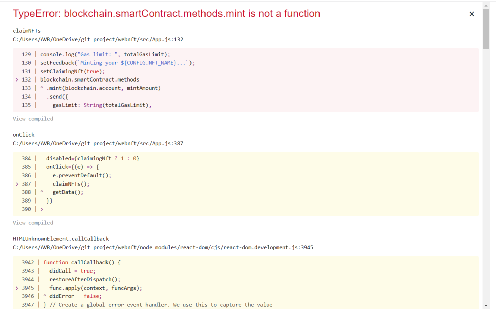
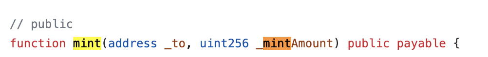

# Minting Website

# 目前問題

1. **在 remix 端不用做更動嗎? 包括 mint 的費用也仍然是以 ether 為單位，但似乎沒看到問題?**
2. **不確定貿然更動參數數量，是否會導致發行者以外的人無法順利 mint ⇒ 待承佑測試**

# Reference

[How To Create a NFT Minting Website for FREE!](https://www.youtube.com/watch?v=NJVkAAZqc0k)

# 智能合約

- 由於使用該影片的合約在發佈時遇到問題無法解決 ⇒ 沿用 Nick 的合約

## 遭遇問題

### 找不到合約名稱



- 原因：Nick 合約的 mint function 與此 Website 中所呼叫的名稱不同
  - Website
    
  - Nic’s Contract
    
- 解法：將 Nick 合約的 mintNicMeta 改名為 mint 在發佈即可

### 合約參數不相符

- 問題：網站的 App.js 的 mint 要求傳入兩個參數，mintAmount & blockchain.account，而 Nic 的合約在 mint 時只需要傳入 mintAmount 數量即可
- 解法：將 App.js 呼叫 mint 時的參數數量減少至一項
  
- **隱憂：不確定貿然更動參數數量，是否會導致發行者以外的人無法順利 mint ⇒ 待測試**

### 合約無法重新操作

<aside>
💡 **At Address 上方的 Contract 要記得選取 !**

</aside>

# 於 Matic Mumbai 發佈 (Polygon Testnet)

- 在 config.json 檔案中，更動 NETWORK 資訊即可
  
- MATIC 測試幣可至以下網站獲得
  [Polygon Faucet](https://faucet.polygon.technology/)

### 在 MetaMask 新增 Matic Mumbai 測試網路

1. 點選新增網路
2. 輸入以下網路資訊即可新增

   

- **隱憂：在 remix 端不用做更動嗎? 包括 mint 的費用也仍然是以 ether 為單位，但似乎沒看到問題?**

# 具體參數設定

## Website 方面

### 圖片

- ./logo-blob.png
- ./public/
  - favicon：分頁上顯示的小小 icon
  - logo192 & logo512：where logo picture goes, size are 192*192 & 512*512
  - config/images
    - bg：背景圖片，1920\*1080
    - example：gif 檔
    - logo：水平的 png logo

### NFT 資訊

- config.json
  ```json
  {
    "CONTRACT_ADDRESS": "0xC839e39c2ca863baFb004c01002a407B3EaA2373", //合約地址
    "SCAN_LINK": "https://mumbai.polygonscan.com/address/0xc839e39c2ca863bafb004c01002a407b3eaa2373" //合約地址畫面的網站連結
    "NETWORK": {
      "NAME": "Matic Mumbai", //網路資訊
      "SYMBOL": "MATIC",
      "ID": 80001
    },
    "NFT_NAME": "Chieh", //NFT名字
    "SYMBOL": "CHNFT", // NFT縮寫(不確定是否有其他意義
    "MAX_SUPPLY": 15, // 網站顯示的最大供給量，可以設跟合約本身不同，但達到最大供給量時網站mint的buttom便會消失(即是合約本身還可以mint)
    "WEI_COST": 150000000000000000, //每次mint所需的費用，可以與合約不同，較高就會扣較多錢，較低就會mint失敗
    "DISPLAY_COST": 0.15, //網站上顯示的mint價格，單純for顯示用，扣的錢看WEI_COST
    "GAS_LIMIT": 285000,
    "MARKETPLACE": "Opeansea",
    "MARKETPLACE_LINK": "https://testnets.opensea.io/collection/nic-meta-kyzwhbzabk", // NFT在Opensea上開賣的網頁連結
    "SHOW_BACKGROUND": true
  }
  ```
- abs.json：將 remix 上面 compile 完的 abs 檔案覆蓋原有的程式碼
- manifest.json：改成自己 NFT 的縮寫和名字
  

# Deploy Website

## Local test

```json
npm install // 安裝所需的dependencies
npm run start // 執行react-scripts start
```

此時會在 local 端開啟網頁，可以先確認是否能正常運行所有功能

## Deploy to Netlify

1. 在 GitHub 上建立一個 Repo 並上傳
2. 把 Repo 丟到 Netlify 上面
3. 將 Build Setting 設置如下，npm run build 後，用 build 的 directory 當 deploy 的目標

   
